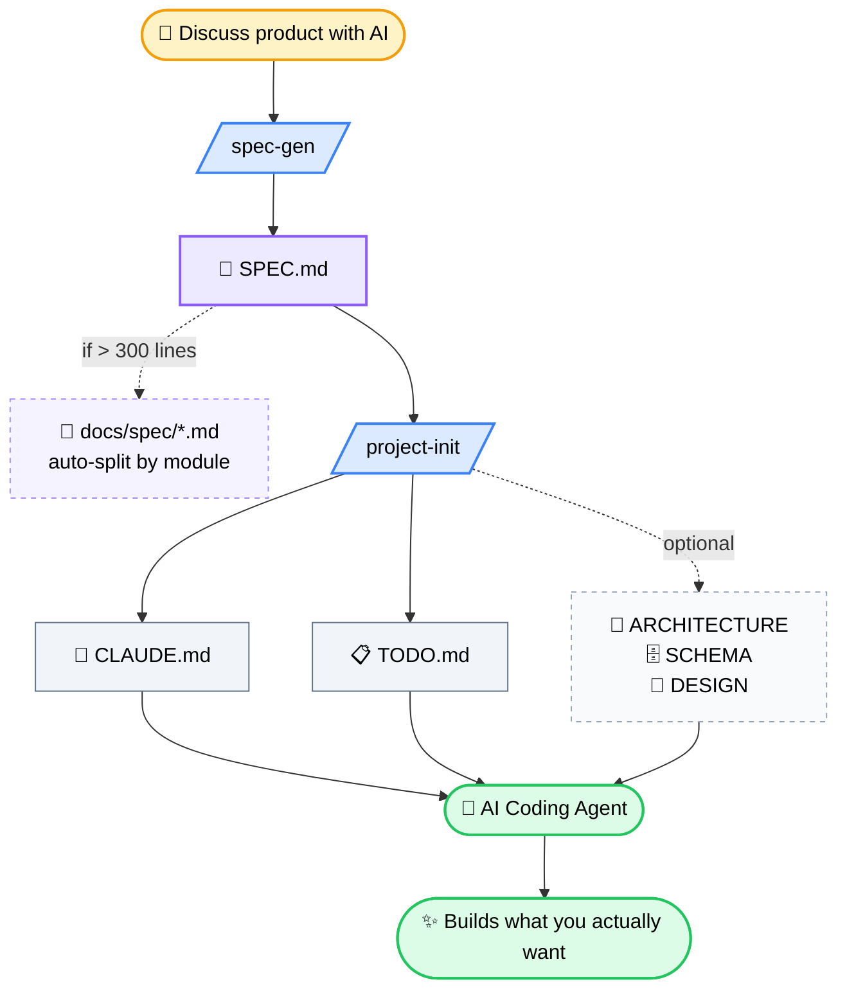
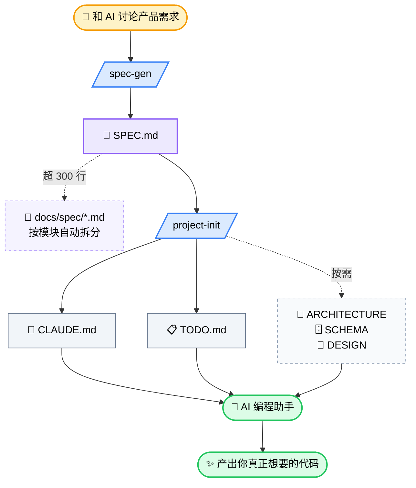

<a id="top"></a>

<div align="center">

# 🔧 Harness Kit

<a href="#chinese-version">🇨🇳 中文文档</a>

    [](https://github.com/fluten)

### Stop prompting. Start harnessing.

A structured project management framework for AI-assisted development. Give your AI coding agent (Claude Code, Cursor, Copilot) a complete operating manual — not just a prompt — so it builds what you actually want.

<i>"When the AI produces bad output, don't ask 'how do I write a better prompt?' — ask 'what's missing from the agent's environment?'"</i><br>
<sub>— The core insight behind Harness Engineering</sub>

</div>

## The Problem

You've been here before:

1. You describe a feature to your AI coding agent
2. It writes code confidently
3. The code doesn't match your product vision, breaks existing modules, or reinvents something you already decided against
4. You spend 30 minutes explaining context that should have been documented
5. Repeat

**The root cause isn't the AI. It's that the AI has no persistent memory of your project's rules, decisions, and boundaries.**

## The Solution

Harness Kit gives your AI agent a structured set of `.md` files that act as its project operating manual. Think of it as onboarding docs for your AI teammate.

**Two Skills, one workflow:**

| Skill | What it does | When to use |
|-------|-------------|-------------|
| **spec-gen** | Generates a standardized `SPEC.md` from your product discussion | After you've figured out what to build |
| **project-init** | Reads your SPEC and generates the management files your AI needs | Before you start coding |

## Workflow



## What Gets Generated

### Always generated (every project)

| File | Purpose |
|------|---------|
| `SPEC.md` | Product requirements — what to build, what NOT to build |
| `CLAUDE.md` | AI behavior rules, file system guide, automation rules — the single entry point |
| `TODO.md` | Prioritized task queue with completion tracking |

### Generated when needed (based on SPEC complexity)

| File | Condition | Purpose |
|------|-----------|---------|
| `ARCHITECTURE.md` | 3+ modules | System structure, module dependencies, data flow |
| `SCHEMA.md` | Has database | Table definitions, relationships, constraints |
| `DESIGN.md` | Has UI | Visual specs, interaction patterns, component rules |

### Created during development (when triggered)

| File | Trigger | Purpose |
|------|---------|---------|
| `ISSUES.md` | First bug or open question | Issue tracking with 4-state workflow |
| `DECISIONS.md` | First architectural decision | ADR records that prevent AI from overturning your choices |
| `PROGRESS.md` | First cross-session handoff | Session continuity log |

**Why not generate everything upfront?** Because a 3-file project doesn't need 9 management files. Over-documentation costs context window tokens and slows down the AI. Harness Kit scales with your project — lightweight when small, comprehensive when complex.

## Quick Start

### Install via command line (recommended)

```bash
# Install to current project (run from your git repo root)
mkdir -p .claude/skills
git clone --depth=1 https://github.com/fluten/harness-kit.git /tmp/harness-kit
cp -r /tmp/harness-kit/skills/* .claude/skills/
rm -rf /tmp/harness-kit

# Or install globally (available for all projects)
mkdir -p ~/.claude/skills
git clone --depth=1 https://github.com/fluten/harness-kit.git /tmp/harness-kit
cp -r /tmp/harness-kit/skills/* ~/.claude/skills/
rm -rf /tmp/harness-kit
```

> Claude Code searches for skills in `.claude/skills/` at the **git repository root**. For project-local install, make sure you run it from the right place.

### Manual install (Claude.ai)

1. Download the `.skill` files from [Releases](../../releases)
2. Settings → Skills → Add Skill → upload both `spec-gen` and `project-init`

### For Cursor / Copilot / other AI tools

The skills are just markdown templates — they work with any AI that reads project files:

1. Clone this repo
2. Discuss your product requirements with your AI
3. Copy `skills/spec-gen/SKILL.md` instructions to generate your `SPEC.md`
4. Copy `skills/project-init/SKILL.md` instructions to generate the rest

### Workflow

```
Step 1: Discuss product requirements with AI
Step 2: "Generate my SPEC" → triggers spec-gen → outputs SPEC.md
Step 3: "Initialize the project" → triggers project-init → outputs CLAUDE.md + TODO.md + (others as needed)
Step 4: Hand everything to your AI coding agent → it reads CLAUDE.md on startup and knows the rules
```

## Key Design Principles

### LLM-readability first

All files are optimized for AI parsing, not human aesthetics. No ASCII art diagrams — relationships are described in structured text that LLMs parse reliably.

```markdown
<!-- Instead of this: -->
┌──────────┐     ┌──────────┐
│ Frontend │───▶│ Backend  │
└──────────┘     └──────────┘

<!-- We write this: -->
- Frontend(React) --REST API--> Backend(FastAPI)
- Backend --ORM--> Database(PostgreSQL)
- Frontend does NOT directly access Database
```

### Locked vs Generated sections

Every file has clearly marked sections:

- **🔒 Locked sections**: Rules that stay the same across projects (issue tracking workflow, automation rules). The AI must not modify these.
- **🔓 Generated sections**: Content the AI fills in based on your SPEC (tech stack, module list, task queue). The AI can update these freely.

Each file starts with a permission table so the AI knows exactly what it can and cannot touch.

### Process files vs Decision files

- **Process files** (TODO, ISSUES, PROGRESS): AI updates autonomously
- **Decision files** (SPEC, ARCHITECTURE, SCHEMA, DESIGN, DECISIONS): AI must ask permission before modifying

This prevents the AI from silently changing your product requirements while "improving" the codebase.

### Auto-split when files outgrow themselves

Large markdown files burn context window and become unreliable for LLM parsing. When `SPEC.md` exceeds **300 lines**, the AI is prompted to split it by module into `docs/spec/*.md`, keeping the main file as a navigation hub with overview + links. The framework grows with your project — but no single file is allowed to bloat.

## Example: ChatLens

The `examples/` directory contains a complete set of files generated for **ChatLens** — a B2B AI conversation analytics platform. See how each template looks when filled with real project data.

> ⚠️ **Heads up**: This example was generated from a quick brainstorm with Claude — not a deep product discovery session. It's meant to show what the templates *look like* when filled in, not what your output should aspire to. Real projects with thorough requirement discussions will produce much richer, more detailed files.

## File Reference

<details>
<summary><b>SPEC.md</b> — Product Requirements</summary>

Structured product spec with: project overview, feature modules (user story format), non-functional requirements, data model, tech constraints, MVP scope (what's in / what's out), glossary.

Splits into `docs/spec/*.md` when exceeding 300 lines.
</details>

<details>
<summary><b>CLAUDE.md</b> — AI Operating Manual</summary>

The single entry point. Contains: project info, file system rules (when to read/modify each file + permissions), automation behaviors (progress tracking, issue linking, spec split alerts), code conventions, session context.

Includes creation templates for third-tier files so the AI can bootstrap them during development.
</details>

<details>
<summary><b>TODO.md</b> — Task Queue</summary>

Three-priority task queue (high/normal/low) with a "current task" focus area limited to 1-3 items. Completed tasks move to a done section with timestamps. Rules enforce synchronization with PROGRESS.md and ISSUES.md.
</details>

<details>
<summary><b>ARCHITECTURE.md</b> — System Structure</summary>

Module breakdown with dependency graph, API interfaces, data flow descriptions, directory structure, and tech stack summary. All in structured text — no diagrams.
</details>

<details>
<summary><b>SCHEMA.md</b> — Data Model</summary>

Table relationships, field definitions with types/constraints, indexes, enums, data conventions (primary key strategy, timestamp format, soft delete policy), migration log.
</details>

<details>
<summary><b>DESIGN.md</b> — UI & Interaction Specs</summary>

Part 1 (Visual): color system, typography, spacing, border radius, component specs.
Part 2 (Interaction): page structure, navigation flow, loading/empty/error states, animation rules.
</details>

<details>
<summary><b>ISSUES.md</b> — Issue Tracker</summary>

Six issue types (BUG/DEBT/QUESTION/LIMIT/PERF/FEAT), four-state workflow (🔴→🟡→🟢→✅), module-prefixed IDs (e.g., `BUG-AUTH-001`), type-specific required fields, auto-archive after 10 verified issues.
</details>

<details>
<summary><b>DECISIONS.md</b> — Architecture Decision Records</summary>

Grouped by module, each with three states (✅ Decided / 💬 Discussing / 🗑️ Deprecated). Records what was chosen, what was rejected and why, and irreversibility level (🟢/🟡/🔴). AI is forbidden from overturning 🔴 irreversible decisions.
</details>

<details>
<summary><b>PROGRESS.md</b> — Session Continuity</summary>

Project status, recent completions, current blockers, milestones, session log. Enables seamless handoff between AI coding sessions.
</details>

## Philosophy

Harness Kit is built on three beliefs:

1. **The AI's environment matters more than the prompt.** A well-structured project context produces better code than clever prompt engineering.

2. **Management overhead should scale with complexity.** A weekend project needs 3 files. An enterprise platform needs 9. Never the other way around.

3. **AIs need guardrails, not micromanagement.** Lock the rules, free the execution. Tell the AI "you must track issues in this format" but let it decide how to implement a feature.

## Contributing

Found a better way to structure a file? Have a template for a file type we haven't covered? PRs welcome.

---

**Built by [Chen](https://github.com/fluten)** — a PM who got tired of explaining the same project context to AI every single session.

---

<a id="chinese-version"></a>

<details>
<summary><b>🇨🇳 中文文档 / Chinese Version</b></summary>

<br>

<div align="center">

# 🔧 Harness Kit

<a href="#top">🇬🇧 English</a>

### 别写 prompt 了，给 AI 套上缰绳。

一套结构化的项目管理框架，为 AI 编程助手（Claude Code、Cursor、Copilot）提供完整的项目操作手册——不是一句提示词，而是一整套规则体系，让 AI 从第一行代码就知道该怎么干。

<i>"当 AI 产出不好时，别想'怎么写更好的 prompt'——想'AI 的环境里缺了什么上下文'。"</i><br>
<sub>— Harness Engineering 的核心洞察</sub>

</div>

## 痛点

你一定经历过：

1. 你跟 AI 描述一个功能
2. 它自信满满地写了一堆代码
3. 代码跟你的产品设想不一样、破坏了现有模块、或者重新发明了一个你已经否决过的方案
4. 你花 30 分钟解释本该被文档记录下来的上下文
5. 循环往复

**根源不是 AI 不行，而是 AI 没有你项目的规则、决策和边界的持久记忆。**

## 解决方案

Harness Kit 给你的 AI 助手一套结构化的 `.md` 文件，充当它的项目操作手册。把它想象成给 AI 新同事写的入职文档。

**两个 Skill，一个工作流：**

| Skill | 做什么 | 什么时候用 |
|-------|-------|-----------|
| **spec-gen** | 把产品讨论整理成标准化的 `SPEC.md` | 聊完需求之后 |
| **project-init** | 读取 SPEC，生成 AI 需要的管理文件 | 开始写代码之前 |

## 工作流



## 生成什么文件

### 必定生成（每个项目都要）

| 文件 | 用途 |
|------|------|
| `SPEC.md` | 产品需求——做什么、不做什么 |
| `CLAUDE.md` | AI 行为规范、文件体系指南、自动化规则——唯一入口 |
| `TODO.md` | 按优先级排列的任务队列 |

### 按需生成（根据 SPEC 复杂度自动判断）

| 文件 | 条件 | 用途 |
|------|------|------|
| `ARCHITECTURE.md` | 模块 ≥ 3 个 | 系统架构、模块依赖、数据流 |
| `SCHEMA.md` | 有数据库 | 表定义、关系、约束 |
| `DESIGN.md` | 有界面 | 视觉规范、交互规则、组件定义 |

### 开发中按需创建（触发时自动生成）

| 文件 | 触发条件 | 用途 |
|------|----------|------|
| `ISSUES.md` | 遇到第一个 bug 或待决策问题 | 四态工作流的问题追踪 |
| `DECISIONS.md` | 遇到第一个架构决策 | ADR 记录，防止 AI 推翻你的决定 |
| `PROGRESS.md` | 第一次跨 session 续接 | 会话连续性日志 |

**为什么不一次全生成？** 因为 3 个文件就能搞定的项目不需要 9 个管理文件。过度文档化消耗上下文窗口、拖慢 AI。Harness Kit 随项目复杂度伸缩——小项目轻量，大项目完备。

## 快速开始

### 命令行安装（推荐）

```bash
# 安装到当前项目（在 git 仓库根目录执行）
mkdir -p .claude/skills
git clone --depth=1 https://github.com/fluten/harness-kit.git /tmp/harness-kit
cp -r /tmp/harness-kit/skills/* .claude/skills/
rm -rf /tmp/harness-kit

# 或全局安装（所有项目可用）
mkdir -p ~/.claude/skills
git clone --depth=1 https://github.com/fluten/harness-kit.git /tmp/harness-kit
cp -r /tmp/harness-kit/skills/* ~/.claude/skills/
rm -rf /tmp/harness-kit
```

> Claude Code 从 **git 仓库根目录** 的 `.claude/skills/` 查找 skill。项目级安装请在正确位置执行。

### 手动安装（Claude.ai）

1. 从 [Releases](../../releases) 下载 `.skill` 文件
2. 设置 → Skills → Add Skill → 上传 `spec-gen` 和 `project-init`

### Cursor / Copilot / 其他 AI 工具

Skill 本质是 Markdown 模板，任何能读项目文件的 AI 都能用：

1. Clone 本仓库
2. 和 AI 讨论产品需求
3. 参考 `skills/spec-gen/SKILL.md` 的规范生成 `SPEC.md`
4. 参考 `skills/project-init/SKILL.md` 的规范生成其他文件

### 工作流

```
第一步：和 AI 讨论产品需求
第二步："帮我生成 SPEC" → 触发 spec-gen → 输出 SPEC.md
第三步："初始化项目" → 触发 project-init → 输出 CLAUDE.md + TODO.md +（按需生成其他文件）
第四步：交给 AI 编程助手 → 它启动时读 CLAUDE.md，知道所有规则
```

## 核心设计原则

### LLM 可读性优先

所有文件为 AI 解析优化，不为人类美观。不使用 ASCII 图——所有关系用结构化文本描述，LLM 解析零歧义。

```markdown
<!-- 不这样写： -->
┌──────────┐     ┌──────────┐
│ Frontend │───▶│ Backend  │
└──────────┘     └──────────┘

<!-- 而是这样写： -->
- Frontend(React) --REST API--> Backend(FastAPI)
- Backend --ORM--> Database(PostgreSQL)
- Frontend 不直接访问 Database
```

### 锁定区 vs 生成区

每个文件有清晰的区块标记：

- **🔒 锁定区**：跨项目不变的规则（issue 追踪流程、自动化行为）。AI 不得修改。
- **🔓 生成区**：AI 根据 SPEC 填充的内容（技术栈、模块列表、任务队列）。AI 可自由更新。

每个文件开头都有权限总表，AI 一目了然。

### 过程文件 vs 决策文件

- **过程文件**（TODO、ISSUES、PROGRESS）：AI 自主维护
- **决策文件**（SPEC、ARCHITECTURE、SCHEMA、DESIGN、DECISIONS）：AI 修改前必须征求用户同意

防止 AI 在"优化"代码的同时悄悄改了你的产品需求。

### 超长文件自动拆分

大型 Markdown 文件烧上下文窗口、LLM 解析也不可靠。当 `SPEC.md` 超过 **300 行** 时，AI 会提醒按模块拆分到 `docs/spec/*.md`，主文件保留为导航中枢（概览 + 跳转链接）。框架随项目增长，但不允许任何单个文件臃肿。

## 示例：ChatLens

`examples/` 目录包含 **ChatLens**（B2B AI 对话分析平台）的完整文件集。可以看到每个模板填入真实项目数据后的样子。

> ⚠️ **说明**：这个示例只是简单跟 Claude 聊了几句想法就直接生成的，并没有深入打磨需求细节。仅用于展示模板填充后的结构长什么样，**不代表最终能达到的细致程度**。真实项目里把需求聊透之后，产出会比这丰富、严谨得多。

## 文件参考

<details>
<summary><b>SPEC.md</b> — 产品需求</summary>

结构化的产品规格文档，包含：项目概述、功能模块（用户故事格式）、非功能需求、数据模型、技术约束、MVP 范围（做什么 / 不做什么）、术语表。

超过 300 行时自动拆分到 `docs/spec/*.md`。
</details>

<details>
<summary><b>CLAUDE.md</b> — AI 操作手册</summary>

唯一入口。包含：项目信息、文件体系规则（何时读取/修改每个文件 + 权限）、自动化行为（进度追踪、issue 关联、spec 拆分提醒）、代码规范、会话上下文。

内置第三级文件的创建模板，AI 可以在开发过程中按需生成。
</details>

<details>
<summary><b>TODO.md</b> — 任务队列</summary>

三级优先级的任务队列（高/中/低），"当前任务"聚焦区限制 1-3 项。完成任务移动到已完成区并附时间戳。规则强制与 PROGRESS.md 和 ISSUES.md 同步。
</details>

<details>
<summary><b>ARCHITECTURE.md</b> — 系统架构</summary>

模块拆分 + 依赖关系、API 接口、数据流描述、目录结构、技术栈总结。全部用结构化文本表达——不使用图表。
</details>

<details>
<summary><b>SCHEMA.md</b> — 数据模型</summary>

表关系、字段定义（含类型/约束）、索引、枚举值、数据约定（主键策略、时间戳格式、软删除策略）、迁移日志。
</details>

<details>
<summary><b>DESIGN.md</b> — UI 与交互规范</summary>

第一部分（视觉）：色彩系统、字体、间距、圆角、组件规范。
第二部分（交互）：页面结构、导航流程、加载/空/错误状态、动效规则。
</details>

<details>
<summary><b>ISSUES.md</b> — 问题追踪</summary>

六种 issue 类型（BUG/DEBT/QUESTION/LIMIT/PERF/FEAT）、四态工作流（🔴→🟡→🟢→✅）、模块前缀 ID（例如 `BUG-AUTH-001`）、按类型区分的必填字段、累计 10 个验证完成后自动归档。
</details>

<details>
<summary><b>DECISIONS.md</b> — 架构决策记录</summary>

按模块分组，每条决策有三种状态（✅ 已决定 / 💬 讨论中 / 🗑️ 已废弃）。记录采纳了什么、否决了什么以及原因、以及不可逆程度（🟢/🟡/🔴）。AI 禁止推翻 🔴 不可逆决策。
</details>

<details>
<summary><b>PROGRESS.md</b> — 会话连续性</summary>

项目状态、近期完成、当前阻塞、里程碑、会话日志。让多个 AI 编程会话之间无缝衔接。
</details>

## 设计哲学

Harness Kit 建立在三个信念之上：

1. **AI 的环境比 prompt 重要。** 结构化的项目上下文比精心设计的提示词产出更好的代码。

2. **管理开销应该匹配复杂度。** 周末项目需要 3 个文件，企业级平台需要 9 个。永远不要反过来。

3. **AI 需要护栏，不是微观管理。** 锁住规则，释放执行。告诉 AI "你必须用这个格式追踪 issue"，但让它自己决定怎么实现功能。

## 贡献

发现了更好的文件结构？有我们没覆盖的文件类型的模板？欢迎 PR。

---

**作者：[Chen](https://github.com/fluten)** — 一个受够了每次都要给 AI 重新解释项目上下文的产品经理。

</details>
